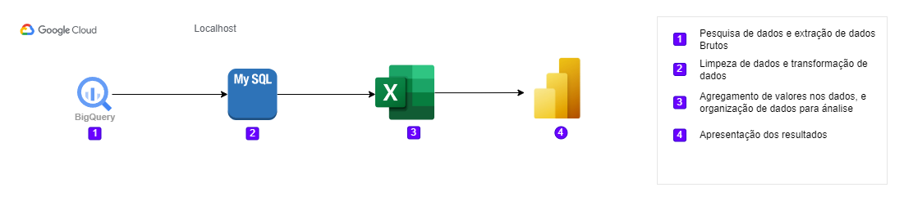

## Análise de dados - Termos populares
Os termos mais populares pesquisados nos ultimos 7 dias do mês de novembro

 

Para visualizar acesse o dashboard [demo](https://app.powerbi.com/view?r=eyJrIjoiNjlhMDc5MGItNGRkMC00MWU4LTkxODctMDhlNmVmMzc3ODcwIiwidCI6IjRmNjUxYzMwLTViODAtNDg3YS04OTBiLTNlMjFlNGY3MTg1ZCJ9)

### Tecnologias utilizadas
- MySQL
- Excel
- PowerBi
- Google Cloud BigQuery

 

